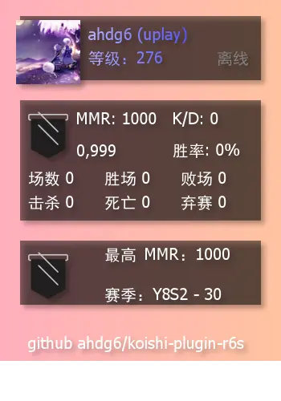
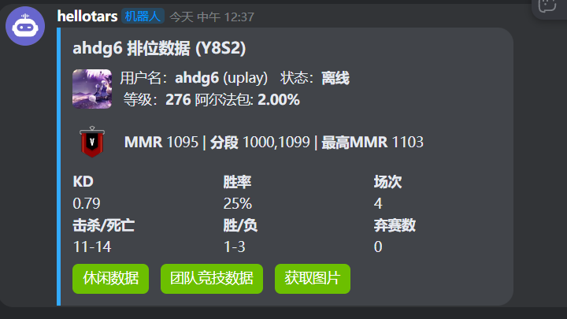

# koishi-plugin-r6s

一个 Koishi 插件，用于查询彩虹六号战绩/查询服务器在线状态，在所有平台支持图片渲染，在 Kook 平台有特殊卡片支持

### 可用指令
- r6rank <名称> - 在其他平台渲染图片，在 Kook 渲染卡片
- r6bind <名称> - 绑定账号，用 userId 存储，名字更改不会影响
- r6pin - Kook 专属，用于在当前聊天固定一张定期更新的服务器状态卡片(请搭配 koishi-plugin-schedule 实现定期更新)
- r6server - 所有平台通用的查询服务器状态
- Kook 平台按钮，支持切换数据显示

### 以下为示例

